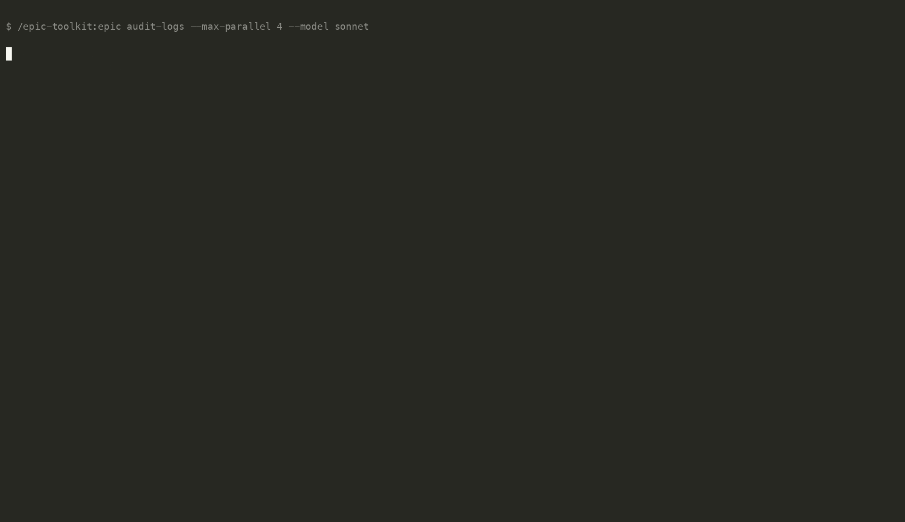

# epic-toolkit

Run multi-session epics as a **directed acyclic graph**, with **parallel siblings
executing in their own git worktrees** and merging back into a coordinator trunk
branch wave by wave. Works with both **Claude Code** and **OpenCode**.



Adds three slash commands:

- Claude Code: `/epic-toolkit:epic.generate <problem statement>` — turns a problem statement into a
  sequence of session prompt files with DAG metadata. For large multi-subsystem
  initiatives it splits the work into multiple epic directories and emits a
  matching sprint config.
- Claude Code: `/epic-toolkit:epic <name>` — runs the generated epic, fanning out parallel waves and
  auto-creating a PR when done.
- Claude Code: `/epic-toolkit:sprint <sprint.json | epic-dir...>` — runs N epics
  back-to-back on a shared trunk branch and opens a single PR for the whole
  sprint (multi-epic orchestrator).

OpenCode exposes the same commands without the Claude plugin namespace:
`/epic.generate`, `/epic`, and `/sprint`.

## Install

**Claude Code:**

```
/plugin marketplace add aramirez087/epic-toolkit
/plugin install epic-toolkit@epic-toolkit
```

Then run the namespaced Claude Code commands:

```
/epic-toolkit:epic.generate <problem statement>
/epic-toolkit:epic <name>
/epic-toolkit:sprint <sprint.json>          # multi-epic, one PR
```

For terminal/scripted setup, the equivalent commands are:

```bash
claude plugin marketplace add aramirez087/epic-toolkit
claude plugin install epic-toolkit@epic-toolkit
```

**OpenCode:**

The `.opencode/commands/` directory is auto-detected. Clone the repo or symlink
`.opencode/commands/` into your project and the `/epic`, `/epic.generate`, and
`/sprint` commands will be available.

## Release / update policy

This plugin uses an explicit version in `.claude-plugin/plugin.json`. Bump that
version for every user-facing release; Claude Code uses it to decide whether
installed users should receive updates. The marketplace entry intentionally does
not duplicate the version, so the plugin manifest remains the single source of
truth.

## Dual-tool support

The orchestrator auto-detects which CLI is running (`claude` vs `opencode`) via
environment variables and PATH lookup. You can force a specific CLI with the
`--cli` flag:

```bash
bash scripts/run-sessions.sh docs/claude-sessions/my-epic --cli opencode
bash scripts/run-sessions.sh docs/claude-sessions/my-epic --cli claude
```

Progress display adapts to the CLI:
- **Claude Code**: streams `--output-format stream-json` through
  `epic-progress.py` for real-time step/tool/target tracking.
- **OpenCode**: streams `--format json` through `epic-progress.py` for the
  same real-time tracking. Both formats are auto-detected.

## What it does

1. **`/epic-toolkit:epic.generate`** writes session prompts under
   `docs/claude-sessions/<epic-name>/`. Each session 01+ gets YAML frontmatter
   declaring its DAG edges (`depends_on`, `touches`, `parallel_safe`).
2. **`/epic-toolkit:epic`** invokes the runner. It:
   - Validates the DAG (no cycles, all deps exist).
   - Computes Kahn-style waves (independent sessions in the same wave).
   - Creates a trunk worktree on `epic/<name>` and per-session worktrees on
     `epic/<name>/sNN-<slug>` for each sibling, branched off the trunk's HEAD.
   - Runs up to `--max-parallel` (default 4) sessions in a wave concurrently
     with a fresh CLI process each (PLAN pass → EXECUTE pass).
   - Iteratively `--no-ff` merges successful siblings into trunk between waves.
   - Auto-commits, auto-creates a GitHub PR via `gh`, cleans up worktrees.
3. **`/epic-toolkit:sprint`** runs N epics back-to-back on a shared trunk
   branch and opens a single PR for the whole sprint. Each epic is a normal
   `/epic-toolkit:epic` run; the wrapper enforces sequential execution,
   forwards `--no-pr` to every epic except the final one, and emits a single
   sprint-level summary.

## Layout produced by `/epic-toolkit:epic.generate`

```
docs/claude-sessions/<epic-name>/
  session-00-operator-rules.md     # prepended to every session
  session-01-charter.md            # solo wave (parallel_safe: false)
  session-02-auth.md               # wave 2 sibling (depends_on: [01])
  session-03-email.md               # wave 2 sibling (depends_on: [01])
  session-04-billing.md            # wave 2 sibling (depends_on: [01])
  session-05-admin-ui.md           # wave 3 (depends_on: [02, 04])
  session-06-ci-gate.md            # final solo wave (depends_on: all)
```

`epic-dag.py --show` renders this as:

```
  ║ Wave 1: [01 charter ]
  ╠ Wave 2: [02 auth   ]  [03 email   ]  [04 billing ]
  ║ Wave 3: [05 admin-ui]
  ║ Wave 4: [06 ci-gate]
```

## Frontmatter fields

```yaml
---
session: 03
title: "Email worker"
depends_on: [01]              # parents in the DAG
touches:                      # globs this session may modify
  - src/email/**
parallel_safe: true           # false forces a solo wave
model: "opus"                 # override default model for this session
cli: "claude"                 # override CLI auto-detection for this session
---
```

Sessions without frontmatter form an implicit linear chain (one per wave) —
the toolkit is fully back-compatible with pre-DAG epics.

## Common flags

| Flag | Default | Description |
|---|---|---|
| `--max-parallel N` | 4 | Concurrent sessions per wave |
| `--strict` | off | Fail on `touches` overlap between siblings |
| `--show-dag` | off | Print the wave layout and exit |
| `--dry-run` | off | Preview without executing (non-destructive) |
| `--start N` | 1 | Resume from session N |
| `--sequential` | off | Force one session per wave (legacy linear) |
| `--model M` | sonnet | Model name (passed to CLI; e.g. `opus`, `sonnet`, `haiku` for Claude) |
| `--cli CMD` | auto | Force CLI: `opencode` or `claude` |
| `--no-worktree` | off | Run trunk in CWD (forces sequential) |
| `--timeout N` | 0 | Session timeout in minutes (0 = no timeout) |
| `--retry N` | 0 | Retry failed sessions N times (0 = no retry) |

See [`docs/epic-guide.md`](docs/epic-guide.md) for the full reference.

## Requirements

- OpenCode (`opencode`) **or** Claude Code (`claude`) on `PATH` — auto-detected, or force with `--cli`
- Python 3.8+ (stdlib only — no extra packages)
- Bash 3.2+
- `git` 2.20+
- `gh` CLI (optional, for auto-PR creation)

## Configuration File

Create `.epic-config.json` in your repository root to set default values:

```json
{
  "timeout": 30,
  "retry": 1,
  "model": "sonnet",
  "cli": "opencode",
  "maxParallel": 6
}
```

CLI flags override config file values. All keys are optional.

## Files

```
.claude-plugin/
  plugin.json              # Claude Code plugin manifest
  marketplace.json         # makes the repo a self-installable marketplace
.opencode/
  commands/                # OpenCode slash commands
    epic.md
    epic.generate.md
    sprint.md
commands/
  epic.md                  # Claude Code /epic-toolkit:epic slash command
  epic.generate.md         # Claude Code /epic-toolkit:epic.generate slash command
  sprint.md                # Claude Code /epic-toolkit:sprint slash command (multi-epic)
scripts/
  run-sessions.sh          # wave orchestrator (dual-tool: claude or opencode)
  run-sprint.sh            # multi-epic sprint orchestrator (one PR for N epics)
  epic-dag.py              # DAG builder + wave scheduler
  epic-progress.py         # stream-json progress display (claude and opencode)
  epic-ui.py               # live terminal dashboard (used by run-sessions.sh)
docs/
  epic-guide.md            # full user guide
  epic-prompt-template.md
```

## License

MIT.
